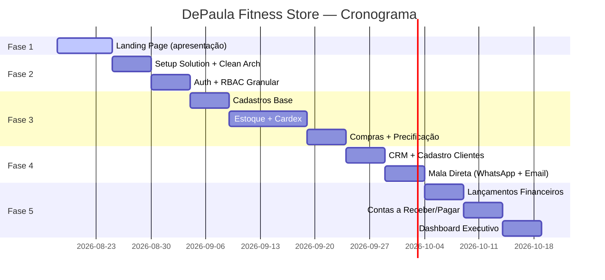

# DePaula Fitness Store — Plano de Implementação

## Visão Geral

Desenvolvimento de uma plataforma completa para a **DePaula Fitness Store** — loja de moda fitness localizada em Campinas/SP (Av. Estados Unidos, 445) dentro do espaço @nossoboxfc. O sistema abrange desde a vitrine digital (landing page/e-commerce) até a retaguarda administrativa (estoque, financeiro, CRM).

> [!IMPORTANT]
> **Fase 1 é prioritária** — será a peça de apresentação para vender o projeto ao dono do estabelecimento. Deve causar impacto visual e demonstrar o potencial da plataforma.

---

## Identidade Visual Identificada

| Elemento | Valor |
|---|---|
| **Logo** | Círculo bordô com monograma "Dp" em script + "DEPAULA FITNESS STORE" |
| **Cor primária** | Bordô/Marsala (#6B2D3E ~ #7A3B4E) |
| **Cor secundária** | Rosa antigo/Rosé (#C4838A ~ #D4A0A7) |
| **Tipografia** | Script elegante (logo) + Sans-serif moderna (corpo) |
| **Tom** | Feminino, empoderador, athleisure premium |
| **Slogan** | "Moda fitness que te acompanha" |
| **Instagram** | @depaulafitness_ (405 seguidores) |

---

## Stack Tecnológica

| Camada | Tecnologia | Justificativa |
|---|---|---|
| **Backend** | ASP.NET Core 9 (C#) | Solicitado pelo cliente; excelente performance e ecossistema |
| **Arquitetura** | Clean Architecture + CQRS (MediatR) | Separação de responsabilidades, testabilidade |
| **Frontend Admin** | Blazor Server (MudBlazor) | SPA em C# puro, sem necessidade de equipe JS separada |
| **Frontend Loja** | ASP.NET Core MVC + Razor Pages | SEO-friendly, SSR, performance |
| **Landing Page (Fase 1)** | HTML/CSS/JS estático | Apresentação rápida e impactante, sem dependência de backend |
| **Banco de Dados** | **PostgreSQL** | Open-source, ACID compliant, excelente para e-commerce com alta consistência, JSON nativo para dados flexíveis, sem custo de licença |
| **ORM** | Entity Framework Core | Migrations, LINQ, type safety |
| **Auth** | ASP.NET Identity + JWT | RBAC nativo, extensível para controle granular |
| **Cache** | Redis (futuro) | Sessões, carrinho, catálogo |

> [!NOTE]
> **Por que PostgreSQL?** Para e-commerce com controle de estoque e alta consistência, PostgreSQL oferece: transações ACID robustas, `SELECT FOR UPDATE` para lock pessimista de estoque, constraints de check nativas, extensões como `pg_trgm` para busca, e custo zero de licenciamento (vs MSSQL). MySQL ficaria como segunda opção, mas o PostgreSQL tem vantagens em integridade referencial avançada e tipos de dados (JSONB, arrays).

---

## Fases de Implementação

---

### 🎯 FASE 1 — Landing Page de Apresentação (ATUAL)
**Objetivo:** Causar impacto e vender o projeto ao proprietário.
**Prazo estimado:** 1 sprint (1 semana)

#### Escopo

Uma landing page estática, moderna e responsiva que simule a experiência da loja online com produtos fictícios inspirados no catálogo real (Instagram). O foco é **impressionar visualmente** e **demonstrar o potencial comercial**.

#### Estrutura da Página

```
📄 Landing Page — depaulafit.com.br
├── 🔝 Header (logo + nav + carrinho simulado)
├── 🖼️ Hero Section (banner fullscreen com CTA)
├── ✨ Categorias (leggings, tops, conjuntos, acessórios)
├── 🔥 Lançamentos (grid de produtos com hover effects)
├── 💎 Seção "Sobre a Marca" (história + diferenciais)
├── 📱 Instagram Feed (embed ou simulação)
├── 📍 Localização (mapa + info do espaço @nossoboxfc)
├── 📧 Newsletter (captura de leads)
└── 🔻 Footer (links + redes sociais + contato)
```

#### Deliverables da Fase 1

| Arquivo | Descrição |
|---|---|
| `1.LandingPage/index.html` | Página principal |
| `1.LandingPage/css/style.css` | Estilos com design system da marca |
| `1.LandingPage/css/animations.css` | Micro-animações e transições |
| `1.LandingPage/js/main.js` | Interatividade (scroll, filtros, carrossel) |
| `1.LandingPage/assets/` | Imagens geradas para produtos e banners |

#### Requisitos de Design
- **Mobile-first** e totalmente responsivo
- Paleta baseada na identidade visual (bordô + rosé + branco)
- Tipografia premium (Google Fonts: Playfair Display + Inter)
- Micro-animações em scroll (fade-in, parallax suave)
- Hover effects nos cards de produto (zoom, overlay)
- Botões com gradiente bordô → rosé
- Glassmorphism sutil em elementos sobrepostos
- Social proof (avaliações fictícias)
- WhatsApp floating button para contato direto

---

### 🏗️ FASE 2 — Infraestrutura e Autenticação
**Objetivo:** Fundação técnica da aplicação.
**Prazo estimado:** 2 sprints (2 semanas)

#### Estrutura da Solution (Clean Architecture)

```
📂 DePaulaFit.sln
├── 📁 src/
│   ├── DePaulaFit.Domain/           # Entidades, interfaces, regras de negócio
│   ├── DePaulaFit.Application/      # Use Cases, CQRS, DTOs, validações
│   ├── DePaulaFit.Infrastructure/   # EF Core, repositórios, serviços externos
│   ├── DePaulaFit.WebApi/           # API REST (Minimal APIs)
│   ├── DePaulaFit.Admin/            # Blazor Server (painel admin)
│   └── DePaulaFit.Store/            # MVC/Razor (loja online)
├── 📁 tests/
│   ├── DePaulaFit.Domain.Tests/
│   ├── DePaulaFit.Application.Tests/
│   └── DePaulaFit.Integration.Tests/
└── 📁 docs/
```

#### Sistema de Segurança (RBAC Granular)

```
Níveis de Acesso (hierárquicos):
├── 🟢 Operador    → Acesso básico às telas autorizadas
├── 🟡 Supervisor  → Herda Operador + aprovações e relatórios
└── 🔴 Master      → Herda tudo + configurações e acessos do sistema

Controle Granular:
├── Módulos → Telas → Ações (CRUD + customizadas)
├── Exemplo: Módulo "Estoque" > Tela "Entrada" > Ações: [Visualizar, Criar, Editar, Excluir, Aprovar]
└── Cada funcionário pode ter permissões individuais além do nível
```

#### Modelo de Dados — Auth & RBAC

```
Tabelas:
├── Users (Id, Name, Email, PasswordHash, Level, IsActive, ...)
├── Roles (Id, Name, Level, Description)
├── Permissions (Id, Module, Screen, Action, Description)
├── RolePermissions (RoleId, PermissionId)
├── UserPermissions (UserId, PermissionId, IsGranted) ← override granular
└── AuditLog (Id, UserId, Action, Entity, OldValue, NewValue, Timestamp)
```

---

### 📦 FASE 3 — Estoque e Compras
**Objetivo:** Controle completo de inventário e reposição.
**Prazo estimado:** 3 sprints (3 semanas)

#### Módulos

**3.1 Cadastros Base**
- Produtos (SKU, nome, descrição, categoria, subcategoria, fotos, grade de tamanhos/cores)
- Fornecedores (CNPJ, contato, prazo de entrega, condições)
- Categorias e subcategorias

**3.2 Movimentações de Estoque**
- Entradas (compra, devolução, ajuste positivo, transferência)
- Saídas (venda, perda, ajuste negativo, transferência)
- Cada movimentação gera lançamento no **Cardex** automaticamente

**3.3 Cardex (Ficha de Estoque)**
- Histórico completo por produto/SKU
- Saldo em tempo real
- Custo médio ponderado atualizado a cada entrada

**3.4 Inventário**
- Contagem física com comparativo vs sistema
- Geração de ajustes automáticos (positivos e negativos)
- Aprovação por Supervisor/Master

**3.5 Precificação**
- Markup configurável por categoria
- Custo médio (do cardex) → preço sugerido
- Preço promocional com data de vigência

**3.6 Controle de Compras**
- Ponto de pedido (estoque mínimo por produto)
- Alerta automático quando atingir mínimo
- Sugestão de compra baseada no consumo médio

**3.7 Venda com Estoque Negativo**

> [!WARNING]
> Regra de negócio especial: normalmente o sistema **bloqueia** venda de produto com estoque zerado. Porém, mediante senha de Supervisor/Master, é possível autorizar uma **venda negativa** (estoque fica < 0). Isso será controlado via lógica de aplicação (não por constraint de banco), permitindo flexibilidade operacional.

```csharp
// Pseudocódigo da regra
if (estoque.Saldo <= 0)
{
    if (!await AuthorizarVendaNegativa(senhaAutorizacao))
        throw new BusinessException("Estoque insuficiente. Autorização necessária.");
    
    // Registra log de auditoria com quem autorizou
    await AuditLog.Registrar("VENDA_NEGATIVA", produto, autorizador);
}
```

---

### 👥 FASE 4 — CRM e Comunicação
**Objetivo:** Gestão de clientes e marketing direto.
**Prazo estimado:** 2 sprints (2 semanas)

#### Módulos

**4.1 Cadastro de Clientes**
- Dados pessoais, endereço, contato
- Histórico de compras
- Tags/segmentos (VIP, inativo, recorrente, etc.)
- Aniversário (para campanhas automáticas)

**4.2 Mala Direta — WhatsApp**
- Seleção de destinatários por filtro/segmento
- Templates de mensagem com variáveis ({nome}, {produto}, etc.)
- Abertura do WhatsApp Web com mensagem pré-formatada (`https://wa.me/55{tel}?text={msg}`)
- Fila de envio (um por um, com botão "próximo")
- Log de envios realizados

**4.3 Mala Direta — E-mail**
- Templates HTML responsivos
- Envio em lote via SMTP (ou integração futura com SendGrid/Mailgun)
- Tracking de abertura (pixel) — futuro

**4.4 Comunicação Rápida**
- Botão "Falar no WhatsApp" no perfil do cliente
- E-mail direto a partir do cadastro

---

### 💰 FASE 5 — Financeiro e Dashboard
**Objetivo:** Controle de gastos, lucratividade e previsão de recebíveis.
**Prazo estimado:** 3 sprints (3 semanas)

#### Módulos

**5.1 Lançamentos Financeiros**
- Receitas (vendas à vista, parceladas)
- Despesas (compras, aluguel, funcionários, marketing)
- Categorias financeiras configuráveis
- Centro de custo

**5.2 Contas a Receber**
- Parcelas de vendas parceladas
- Status (pendente, recebido, vencido, cancelado)
- Baixa manual ou automática (futura integração bancária)

**5.3 Contas a Pagar**
- Fornecedores, despesas fixas e variáveis
- Agendamento e alertas de vencimento

**5.4 Lucratividade**
- CMV (Custo de Mercadoria Vendida) automático via cardex
- Margem de contribuição por produto, categoria e período
- Relatório de DRE simplificado

**5.5 Dashboard Executivo**
- 📊 Previsão de recebíveis no mês (gráfico de barras/linha)
- 📈 Faturamento diário, semanal, mensal (comparativo)
- 🏆 Top 10 produtos mais vendidos
- ⚠️ Alertas de estoque mínimo
- 💸 Despesas vs Receitas (gráfico comparativo)
- 📉 Inadimplência (recebíveis vencidos)

---

## Cronograma Geral



---

## User Review Required

> [!IMPORTANT]
> **Decisão sobre a Fase 1:** Vou criar a landing page completa com imagens geradas por IA representando os produtos fitness (leggings, tops, conjuntos). As imagens serão estilizadas no tom da marca. Deseja algum produto ou modelo específico em destaque?

> [!IMPORTANT]
> **Banco de dados:** Recomendo **PostgreSQL** pelos motivos listados acima. Confirma essa escolha, ou prefere SQL Server (MSSQL) considerando familiaridade da equipe?

## Decisões Confirmadas com o Cliente

- **PostgreSQL**: Confirmado como SGBD do projeto (disponível no plano SmartASP).
- **Gateways de Pagamento**: Mercado Pago e PagSeguro para a fase de e-commerce.
- **Emissão Fiscal (NF-e/NFC-e)**: Arquitetura preparada com abstração para futuro módulo de notas fiscais.
- **Estrutura Multi-Loja**: Modelo de dados preparado com chave `StoreId` para facilitar expansão futura sem refatoração.
- **Manutenção**: Foco total em estabilidade e facilidade de uso pela equipe da loja, sem dependência de equipe técnica interna.

---

## Verificação

### Fase 1 — Landing Page
- Teste visual em dispositivos mobile, tablet e desktop
- Lighthouse score (Performance, SEO, Accessibility ≥ 90)
- Validação do HTML (W3C)
- Cross-browser (Chrome, Firefox, Safari, Edge)
- Apresentação ao cliente para feedback

### Fases Subsequentes
- Testes unitários e de integração
- Testes de carga no módulo de estoque (concorrência)
- Validação do RBAC com cenários de múltiplos perfis
- Auditoria de segurança
