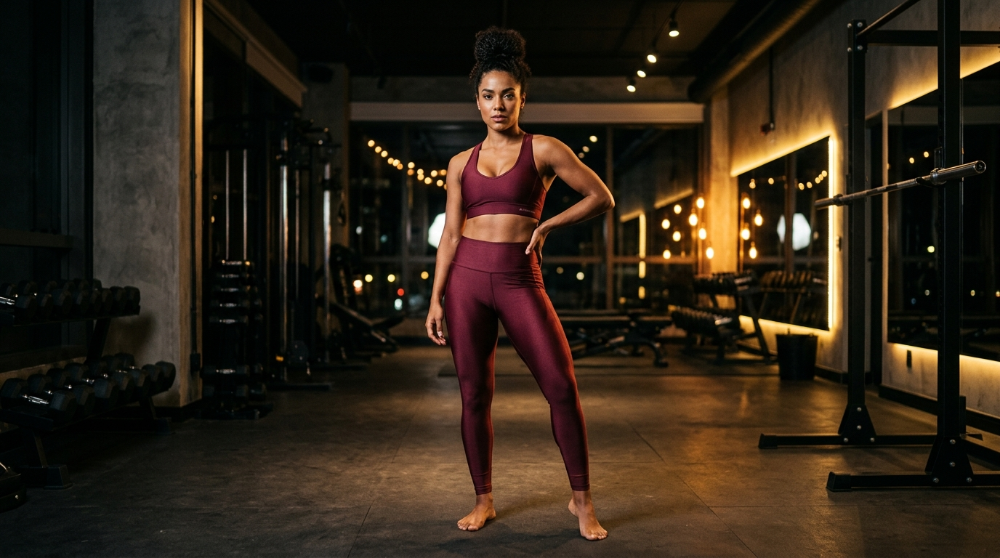

# DePaula Fitness Store — Vitrine Digital (Fase 1)



Vitrine digital e landing page institucional da **DePaula Fitness Store** — marca de moda fitness feminina localizada em Campinas/SP (Av. Estados Unidos, 445 — espaço `@nossoboxfc`).

🌐 **Site no ar (Demo):** [depaulafitness.netlify.app](https://depaulafitness.netlify.app/)

---

## 📌 Sobre esta Fase (Fase 1)

Esta primeira etapa do projeto foi desenvolvida como uma **peça de apresentação de alto impacto visual** para expor a marca, apresentar a nova coleção e validar a navegação e experiência da loja online antes do desenvolvimento do sistema completo.

### 🌟 Destaques da Landing Page:
- **Hero Banner:** Imagem de campanha editorial com tipografia serifada elegante (`Cormorant Garamond`).
- **Strip Marquee:** Faixa animada bordô com destaques e benefícios (Frete Grátis, Troca Fácil, etc.).
- **Categorias:** Grid assimétrico com destaque para Conjuntos, Leggings, Tops e Shorts.
- **Vitrine de Lançamentos:** Grid de produtos fictícios baseados no catálogo real com badges de status, seletor de tamanhos, botão de favoritos (Wishlist) e simulação de adição ao carrinho.
- **Brand Story:** Seção sobre a história da marca no espaço `@nossoboxfc`, destacando 4 pilares da empresa.
- **Depoimentos:** Avaliações de clientes satisfeitas com estrelas.
- **Feed do Instagram:** Simulação visual do feed da `@depaulafitness_`.
- **Localização:** Informações de atendimento da loja física em Campinas/SP com atalho para o Google Maps.
- **CTA WhatsApp Flutuante:** Botão de contato direto pré-formatado para o WhatsApp `(19) 98140-0977`.
- **Proposta Comercial:** Apresentação interativa em slides contida em `0.DOCS/apresentacao/apresentacao.html`.

---

## 🛠️ Tecnologias Utilizadas (Fase 1)

- **Estrutura:** HTML5 Semântico
- **Estilização:** CSS3 Vanilla (Tokens de cor, CSS Grid, Flexbox, Animações e Keyframes)
- **Comportamento:** JavaScript ES6+ (Scroll Reveal via Intersection Observer, Toast Notifications, Mobile Menu, Contador animado)
- **Ícones:** Phosphor Icons
- **Tipografia:** Google Fonts (*Cormorant Garamond* e *DM Sans*)
- **Hospedagem:** Netlify (Deploy Contínuo via GitHub)

---

## 📂 Estrutura de Pastas

```
├── 1.LandingPage/          # Código-fonte da Landing Page
│   ├── index.html          # Página principal
│   ├── css/style.css       # Design system e folhas de estilo
│   ├── js/main.js          # Scripts de interatividade
│   └── assets/images/      # Imagens de produto, banners e logo
├── 0.DOCS/                 # Documentação e proposta comercial
│   ├── apresentacao/       # Apresentação interativa em HTML/CSS para o cliente
│   └── implementation_plan.md  # Plano de implementação completo do projeto
├── netlify.toml            # Configuração de deploy do Netlify
└── README.md               # Este arquivo
```

---

## 🚀 Próximas Fases Planejadas

- **Fase 2:** Arquitetura C# (ASP.NET Core 9), PostgreSQL, Painel Administrativo em Blazor Server e RBAC granular (Operador, Supervisor, Master).
- **Fase 3:** Gestão Completa de Estoque, Cardex, Inventário, Precificação por Markup e Compras.
- **Fase 4:** Mini CRM com disparo de Mala Direta via WhatsApp Web e E-mail.
- **Fase 5:** Módulo Financeiro com DRE, Controle de Recebíveis e Dashboard Executivo.

---

## 🔒 Licença (No License)

**Copyright © 2026 DePaula Fitness Store. Todos os direitos reservados.**

Este código-fonte e seus recursos visuais pertencem exclusivamente à **DePaula Fitness Store**. Nenhuma parte deste projeto pode ser reproduzida, distribuída ou transmitida sob qualquer forma sem a autorização prévia e por escrito dos proprietários.

---
*Desenvolvido com foco em performance e elegância visual.*
